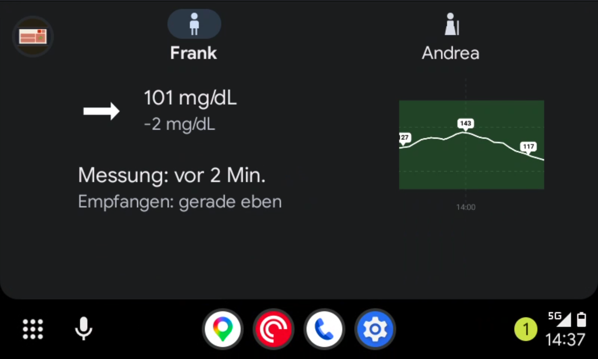
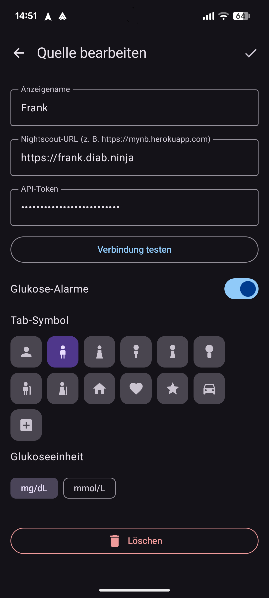

# AutoSugar

AutoSugar brings your blood glucose data into the car. Monitor your Nightscout CGM readings directly on your vehicle's head unit — glanceable, hands-free, and always up to date.

 

 

---

## Features

- **Multiple sources** — switch between Nightscout instances for yourself, your children, or anyone you care for
- **Glanceable display** — current glucose value, trend arrow, and delta at a glance
- **Background updates** — continuous polling keeps readings fresh while you drive
- **Configurable alerts** — get notified when glucose leaves your target range
- **English & German** — with more languages easy to add

---

## Getting Started

### 1. Install the app

Get AutoSugar from the [Google Play Store](https://play.google.com/store/apps/details?id=de.autosugar) or sideload the APK from [GitHub Releases](https://github.com/EarMaster/AutoSugar/releases).

### 2. Enable Developer Mode in Android Auto *(sideloaded APK only)*

If you installed from the Play Store, skip this step. For sideloaded APKs:

1. Open the **Android Auto** app on your phone
2. Tap the **"Version"** entry in the footer 10 times to unlock Developer Settings
3. Open the top-right menu → **Developer settings** → enable **Unknown sources**

### 3. Connect your Nightscout source

Open AutoSugar on your phone and add a source:

- **Display name** — shown as a label on the Android Auto screen
- **Nightscout URL** — the base URL of your Nightscout instance (e.g. `https://mynb.herokuapp.com`)
- **API Token** — your Nightscout API token (leave empty if your instance is public)
- **Glucose alerts** — enable to receive alerts when readings go out of range
- **Tab icon** — choose an icon to identify this source on the car screen
- **Glucose unit** — mg/dL or mmol/L

Tap **Test connection** to verify, then save. Add more sources to switch between them on the car screen.

---

## Privacy

AutoSugar communicates exclusively with the Nightscout instances you configure. No data is sent to any third party.

---

## License

[MIT](LICENSE)
