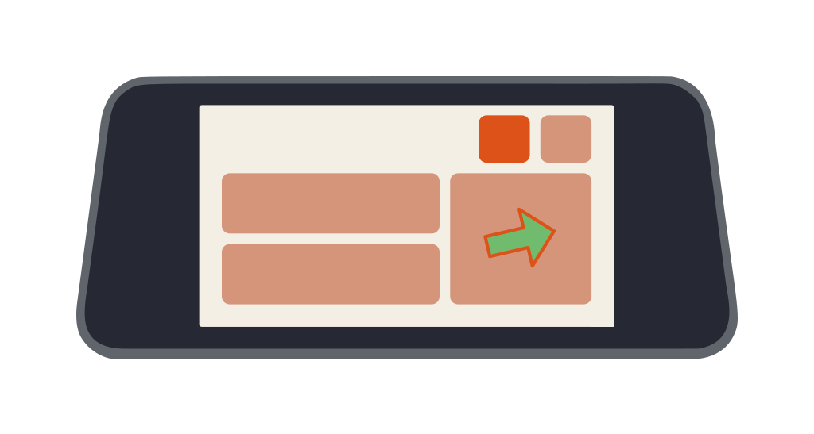
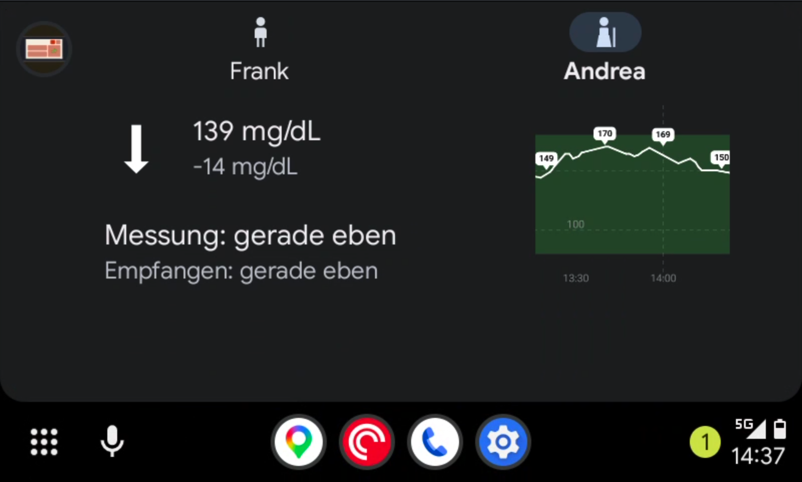
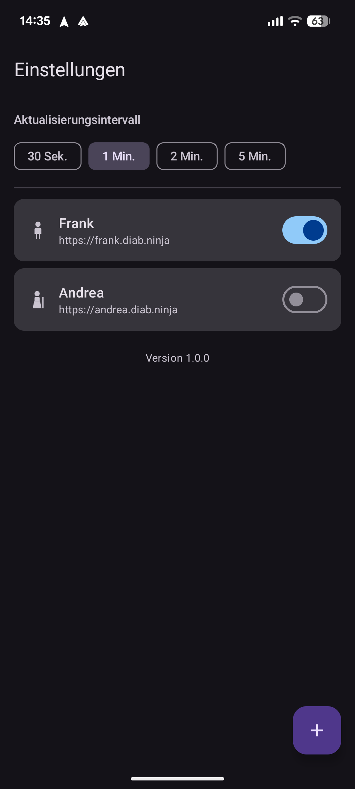

# AutoSugar

Blood glucose monitoring for Android Auto — see your [Nightscout](https://nightscout.github.io) CGM data at a glance, right on your car's display.

[Other installation options →](install)

## Features

  
  

- Monitor one or multiple [Nightscout](https://nightscout.github.io) sources (e.g. yourself and your children)
- Current glucose value, trend arrow, and delta
- Configurable glucose alerts
- Available in English, German, Spanish, French, Dutch, Italian, Portuguese, Arabic, Japanese, Chinese, and Hindi

## Configuration

  
  

1. **Open AutoSugar** on your Android phone and tap **Add profile**.
2. Enter your [Nightscout](https://nightscout.github.io) URL (e.g. `https://yoursite.herokuapp.com`) and an optional display name.
3. If your Nightscout instance requires authentication, enter your API secret.
4. Set your preferred glucose unit (mg/dL or mmol/L) and alert thresholds.
5. **Connect Android Auto** — AutoSugar will appear in the app launcher on your car's display.

You can add multiple profiles to monitor different Nightscout sources (e.g. one for yourself and one for your child). Use the profile list in the app to switch or reorder them.

## Source code

Open source — find the code and report issues on [GitHub](https://github.com/EarMaster/AutoSugar).
